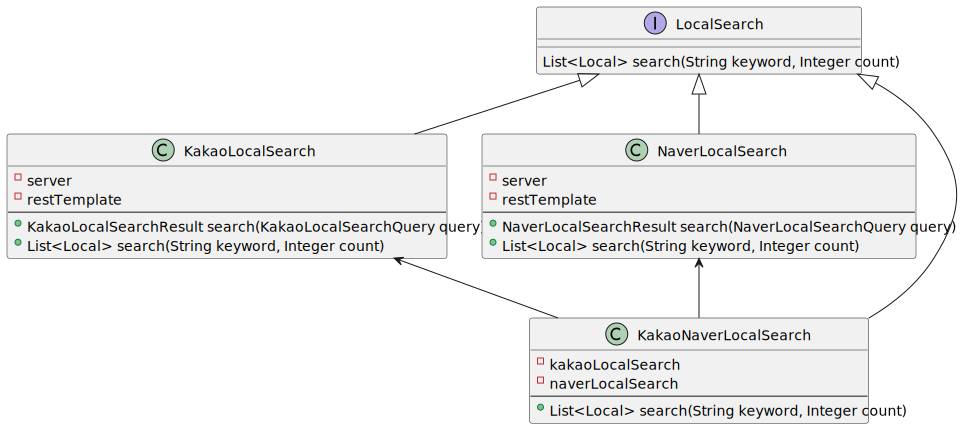

# 개요
장소 검색 서비스

# 외부 라이브러리

* lombok : class 정의간 Getter, Setter, Equals, HashCode 등의 반복적인 코드 작업을 줄이기 위해서 사용
* h2 : 개발 편의를 위해서 memory db인 h2를 사용
  * 다른 jpa를 사용하여 DB 접근을 하기에 다른 DB로 변경이 용이할 것으로 예상

# API 테스트 방법

## 1. 장소 검색
```
curl "http://localhost:8080/local/v1/locals/search?keyword={keyword}
```

예)
```
curl "http://localhost:8080/local/v1/locals/search?keyword=%EA%B3%B1%EC%B0%BD"
```

## 2. 검색 키워드 목록

```
curl "http://localhost:8080/local/v1/keywords"
```

# 같은 장소 판단
API 결과 차이로 인해서 같은 장소 여부 판단에 어려움이 있음.
* 주소가 같으나 장소명이 다른 경우 존재(청어람 본점, 청어람 망원점)
* 주소 시.도 표현 방법이 다르다. (서울, 서울특별시)
* 네이버는 층수까지 표시하는 경우가 있다.
* 네이버는 title에의 키워드에 매칭되는 부분 볼드(<b></b>)처리
* 좌표계가 다르다.
  * 카카오: WGS84
  * 네이버: KTM

[구현]  
동일 장소임을 비교
  1. 카카오의 시.도(첫번째) 항목이 네이버의 시작과 같음을 확인
  2. 카카오의 두번쨰 항목 부터 주소가 네이버의 주소에 포함여부 확인

[미구현]  
네이버 좌표를 카카오 좌표계 변환 API를 이용하여 변환 후, 소수점 4자리까지 비교하여 동일하면 같은 장소로 판단

청어람 망원점
```
Kakao x=126.907469581002,   y=37.558105169041376  
Naver x=126.90749782600689, y=37.558136571392865 (좌표계 변환 API로 변환한 값)
```

## 참고 데이터
Kakao 청어람 망원점
```
{
    "documents": [
        {
            "address_name": "서울 마포구 망원동 482-3",
            "category_group_code": "FD6",
            "category_group_name": "음식점",
            "category_name": "음식점 > 한식 > 육류,고기 > 곱창,막창",
            "distance": "",
            "id": "13292214",
            "phone": "02-332-1411",
            "place_name": "청어람 본점",
            "place_url": "http://place.map.kakao.com/13292214",
            "road_address_name": "서울 마포구 망원로 97",
            "x": "126.907469581002",
            "y": "37.558105169041376"
        }
    ],
    "meta": {
        "is_end": true,
        "pageable_count": 1,
        "same_name": {
            "keyword": "청어람 망원점",
            "region": [],
            "selected_region": ""
        },
        "total_count": 1
    }
}
```

Naver 
```
{
    "lastBuildDate": "Thu, 28 Jul 2022 04:37:16 +0900",
    "total": 1,
    "start": 1,
    "display": 1,
    "items": [
        {
            "title": "<b>청어람 망원점</b>",
            "link": "",
            "category": "한식>곱창,막창,양",
            "description": "",
            "telephone": "",
            "address": "서울특별시 마포구 망원동 482-3",
            "roadAddress": "서울특별시 마포구 망원로 97",
            "mapx": "303671",
            "mapy": "551215"
        }
    ]
}
```

# 기술적 요구사항

## 동시성 이슈

### 키워드 검색 횟수 증가

구현 : 비관적 락을 사용
```
/**
 * 키워드 조회 (For Update)
 */
@Lock(LockModeType.PESSIMISTIC_WRITE)
@Query("SELECT k FROM Keyword k WHERE k.keyword = :keyword")
Optional<Keyword> findByIdForUpdate(String keyword);
```

추가 고려사항

* 비관적 락 적용으로 인한 부작용 고려
  * 사용자 반응성
    * 검색 API 호출 후, 검색 수 증가는 별도 스레드로 처리하기에 검색 API 호출자의 영향도 최소화
    * 키워드 목록 API 호출의 경우도 캐쉬를 적용하여 비관적 락 적용에 따른 영향도 최소화
  * (미구현) 검색 호출 수 증가에 따른 처리 지연 및 DB 부하
    * 검색 호출 후, 바로 검색 수를 업데이트하지 않고 묶어서 처리하는 방안 고려
      * 일정 시간 키워드 별 검색 건수를 메모리에 관리 후, 일괄 업데이트 고려
      * 큐(예) Kafka 등)를 이용하여 지연 및 묶음 처리 고려 

## API 제공자의 장애 발생 상황에 대한 고려

### 구현내용
장애 발생시 빈 결과값 처리 - try-catch 적용 후, Exception 발생 시 빈 결과값 반환

카카오, 네이버 API가 동시에 장애가 발생하는 확률은 낮을 것으로 생각하여 대부분의 경우 결과 반환 가능할 것으로 예상  


개선을 위한 고민  
* 검색에 성공 한 결과를 DB와 같은 저장소에 업데이트 하면서 저장해 두었다가, 서비스 장애로 인한 호출 실패 시 저장된 데이터 활용
  * 검색 결과를 영속성 저장소에 저장가능 한지 확인 필요

## 구글 장소 검색 등 새로운 검색 API 제공자 추가 시 변경 영역 최소화에 대한 고려
LocalSearch 인터페이스를 정의하고 카카오, 네이버 및 카카오와 네이버를 조합한 검색 로직을 구현하고,
검색이 필요한 곳(LocalSearchService)은 LocalSearch 를 Inject 받아 사용하도록 사용하여,
추후 추가적인 검색 API 제공자 추가시에도 유연하게 대응 가능한 것으로 생각



```
public interface LocalSearch {
    List<Local> search(String keyword, Integer count);
}
```

```
@Bean
public LocalSearch kakaoNaverLocalSearch() {
    return new KakaoNaverLocalSearch(
            new KakaoLocalSearch(
                    appProperties.getKakao().getServer(),
                    appProperties.getKakao().getRestApiKey()),
            new NaverLocalSearch(
                    appProperties.getNaver().getServer(),
                    appProperties.getNaver().getClientId(),
                    appProperties.getNaver().getClientSecret()));
}
```

```
@Service
public class LocalSearchService {
    private final LocalSearch localSearch;
    ...
    public SearchResult search(String keyword) {
        var result = localSearch.search(keyword, searchCount);
        ...
    }
```

## 서비스 오류 및 장애 처리 방법에 대한 고려

* 로깅
  * Access 로그 : Access 로그 기반 서비스 정상여부(호출 수, 지연여부, 상태코드 등) 확인 : log -> fluentd -> (kafka -> fluentd) -> elastic search -> (kinana or grafana)
  * 서버 로그 : 오류 발생시 원인 파악을 위한 로그 : log -> fluentd -> (kafka -> fluentd) -> elastic search -> kibana
* (미구현) 서버 메트릭 모니터링
  * Actuator가 제공하는 서버 메트릭 : CPU, Memory 등 서버 상태 확인 : metric -> logstash -> influxdb -> grafana
  * 서버 또는 K8S Pod 를 직접 모니터링하는 지표 참고 : (서버, k8s 지표) -> grafana

## 대용량 트래픽 처리를 위한 반응성(Low Latency), 확장성(Scalability), 가용성(Availability)를 높이기 위한 고려

###  반응성
* API에 캐쉬를 적용
  * Spring @Cacheable 추상화 기능을 사용하여 결과를 캐쉬
  * 캐쉬 구현체는 Memory를 사용. 추후 캐쉬 용량 및 성능 등의 확장이 필요한 경우 Redis와 같은 솔루션으로 대체 가능
* 지역 검색
  * 장소에 대한 정보의 업데이트가 빈번하지 않을 것으로 생각하여 특정 키워드에 대하여 캐쉬를 적용
  * 사용자가 적은 새벽에 전체 캐쉬를 제거하고, 순차적으로 
* 키워드 검색
  * 검색 횟수가 계속 증가하나 정확한 수치가 중요하지는 않다고 판단
  * 캐쉬를 10분마다 삭제
* Redis로 변경하는 경우
  * 캐시 삭제를 서버별로 하는 것이 아니라, 캐시 삭제 API를 생성 후 Jenkins 등을 이용하여 주기적으로 호출 하도록 수정 필요

### 확장성
* 서버
  * 서버가 특정 상태를 가지지 않도록 개발
  * API 서비스 및 DB 부하에 제한이 없다면 서버를 추가하는 것으로 대응 가능
* API 서비스
  * API 서비스가 부하를 대응하지 못하거나, 쿼터 문제가 있는 경우
  * 쿼터 문제의 경우 신규 ID 발급으로 대응 가능한지 확인 필요
* DB
  * 조회는 캐쉬를 사용하기에 부하에 크게 영향 받지 않을 것으로 예상
  * 추가/수정 도 키워드 검색 횟수만 사용하기에 큰 부하는 없을 것으로 예상
  * 검색 호출 건수가 높아서 DB 부하가 높아진다면, 검색 발생 시 바로 DB를 수정하는 것이 아니라 일정 시간 검색 건수를 누적 후, 검색 건수를 업데이트 하는 것을 고려 필요
 
### 가용성
    
* 서버
  * On-Premise 환경
    * 서버들을 L7 VIP로 묶어서 처리, VM 서버는 가능하다면 다른 호스트 서버, 다른 IDC에 위치하여 장애 발생에 대응
    * 지표상 최고 부하가 발생하는 시점을 기준으로 서버를 준비 및 셋팅
    * 만약 사용량에 따라 서버 개수를 조정할 수 있다면 사용 고려
  * K8S 환경
    * Pod가 배포되는 노드가 물리적으로 분리되도록 구성
    * Pod 수가 충분히 많다면 노드가 물리적으로 분리되어 구성되었는지 확인
    * Pod 수가 적다면 node selector, node affinity 등을 이용해서 같은 노드에 Pod가 실행되지 않도록 설정
    * 사용량 증가 대응을 위하여 HPA를 이용하여 CPU 사용율에 따라서 Pod의 개수를 조절

## 지속적 유지 보수 및 확장에 용이한 아키텍처에 대한 설계

### 패키지 구조
DDD(도메인 주도 개발) 개념을 참조하여 패키지 구조 구성

* local : 장소 Bounded Context
  * domain
    * event : 도메인 이벤트
    * model : 도메인 모델
    * repository : 저장소
  * dto : 데이터 전송 객체
  * eventhandler : 이벤트 처리자
  * service : 트랜잭션, 유효성 검사 등 공용 로직 처리
  * infrastructure : 도메인 로직 외 외부 연동(DB, API 등)
  * userinterface : 사용자 Endpoint
* shared : 특정 Context에 포함되지 않는 공용 코드

### 참조 관계

* 참조 관계를 역전하지 않음 
  * userinterface -> service -> domain
* service는 상호 참조 가능
* domain 모델은 service 레이어 내에서만 사용하고, service 레이어 밖으로 반환하는 값은 Dto를 사용

## AOP 적용 순서

1. @PublishEvent - 장소 검색시 캐쉬 값 반환시에도 검색 이벤트는 발생애야 하므로 @Cacheable 보다 먼저 적용 
2. @Cacheable - 트랜잭션 적용 전에 캐쉬를 체크하여 캐쉬가 존재하면 반환해야 하기에 @Transactional 보다 먼저 적용 
3. @Transactional


## 에러 처리
비즈니스 에러인 경우 BusinessException을 ErrorCode와 함께 throw  
Exception은 @ControllerAdvice를 이용하여 공통 에러 처리    
ControllerAdcive 구현 : ServerControllerAdvice (최소한의 에러처리만 구현)

PageNotFound가 ErrorController에서 처리되지 않도록 아래 설정 추가
```
spring:
  web:
    resources:
      add-mappings: false
  mvc:
    throw-exception-if-no-handler-found: true
```

### 고려사항
Spring Security와 같이 필터를 사용하는 기능을 적용한다면 ErrorController 로직도 보완해야 한다.

## 유효성 처리
1. Service 레이어 진입 시 @Validated, @Valid를 이용하여 기본적인 검증을 진행
2. Service 레이어 안쪽의 Service간, DomainModel, Repository(DB)의 데이터는 신뢰하고 개발
